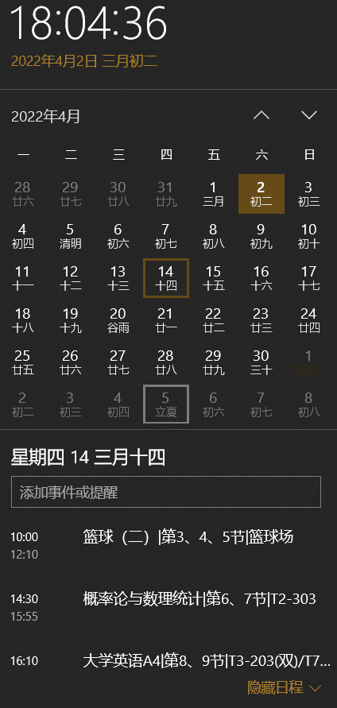
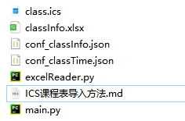
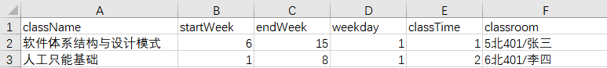
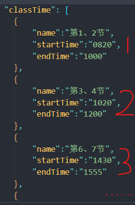
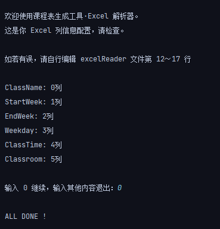
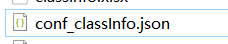
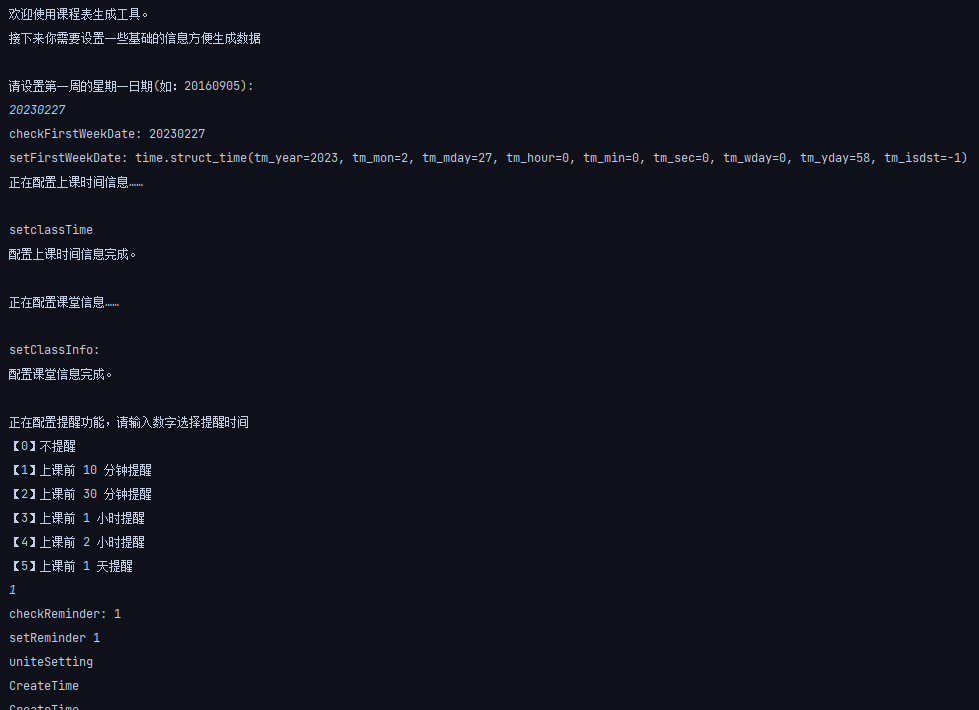
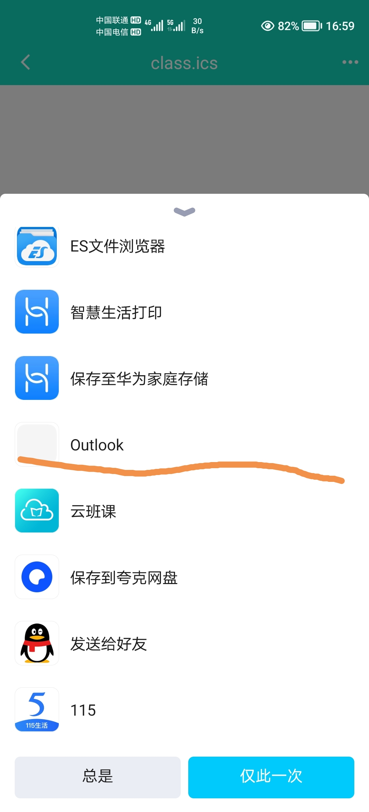

## ICS课程表导入方法

> ​	*写在前面：我运行时环境为python3.x环境，需自行配置，如果一定要在2.x环境运行的话，代码里有修改注释，源代码是在网络上找的（[又到了每年此刻，教你把课程表导入日历]([又到了每年此刻，教你把课程表导入日历 - 少数派 (sspai.com)](https://sspai.com/post/39645)))，下载后修改了一些问题（包括修改为3.x运行环境），另外原作者完全没有注释，遇到问题时去啃代码也是蛮痛苦的。*
>
> ​	*另外同步到日历后也有一些好处，~~比如装x~~，查看课程表时不再需要连接网络，并且上课前日历会自动提醒（可设置提前多久），电脑查看也很方便，如下图*
>
> 

### 开始

> 主要文件
>
> 

* 编辑`conf_classTime.json`文件中的数据，其中数据代表着第几节课，课程开始时间，结束时间

  > 这个我已经按照我自己实际情况编辑好了，使用的是学校的作息时间，其他学校根据实际去改

* 编辑classInfo.xlsx文件，其中的截图和各列数据意义如下

  > 

  > | `className` | `startWeek` | `endWeek`  | `weekday`  | `classTime` | `classroom` |
  > | :---------: | :---------: | :--------: | :--------: | ----------- | :---------: |
  > |  课程名称   | 第几周开始  | 第几周结束 | 星期几上课 | 第几节上课  |    教室     |
  >
  > * 其中的`classTIme`对应`conf_classTime.json`文件中的数据，从“1“开始数，如`classTime`在`xlsx`文件中为1，表示这节课的上课时间为`conf_classTime.json`文件中的第一条数据（如下图）
  >   
  > * 压缩包里的`xlsx`文件中的数据直接删除就好，是我测试时的数据

* 运行`excelReader.py`文件，注意运行过程中需要输入0继续，完成后会生成一个`conf_classInfo.json`文件

  **注意在运行之前最好先把文件夹中的`conf_classInfo.json`文件删除**

  > 运行此文件需要安装`xlrd`软件包，且必须安装1.2.0版本的包，最新版本不支持读取此表格文件
  >
  > 运行时会出现下列内容，做为检查数据列和上一步配置的excel文件表头是否一一对应，一般输入数字零，然后回车即可完成运行
  >
  > 
  >
  > 运行完成后生成文件图片如图：

* 运行`main.py`文件，中间需要输入本学期开学第一天的时间（格式为`20020101`）和选择日历提前多久提示上课，完成后会生成一个`class.ics`文件

  **同样在运行前最好先把原有的`class.ics`文件删除**

  > 正常运行时的情况，蓝色部分为输入的内容：
  >
  > 
  >
  > 生成的文件：

* 电脑直接双击打开`class.ics`文件即可，win10系统会自动导入，其他的大同小异，手机也可以直接打开文件，选择使用手机日历打开，即可保存到手机日历中。

  *注意win10系统打开后可能会出现所有时间都提前一个小时的情况，这个是win10日历固有的问题，截止书写这句话的时候win10日历尚未解决该问题*

  > **解决方案**：下载Outlook邮箱的手机app，将`class.ics`文件发送到手机，打开时选择使用outlook打开即可
  >
  > 注意手机outlook登录的邮箱账号需要和电脑使用的是同一个邮箱账号。
  >
  > **注：**outlook导入日历时最好导入到新建的空白日历中，默认的日历不可删除，且outlook邮箱不支持批量删除日历数据，数据如果出错的话会很麻烦。

